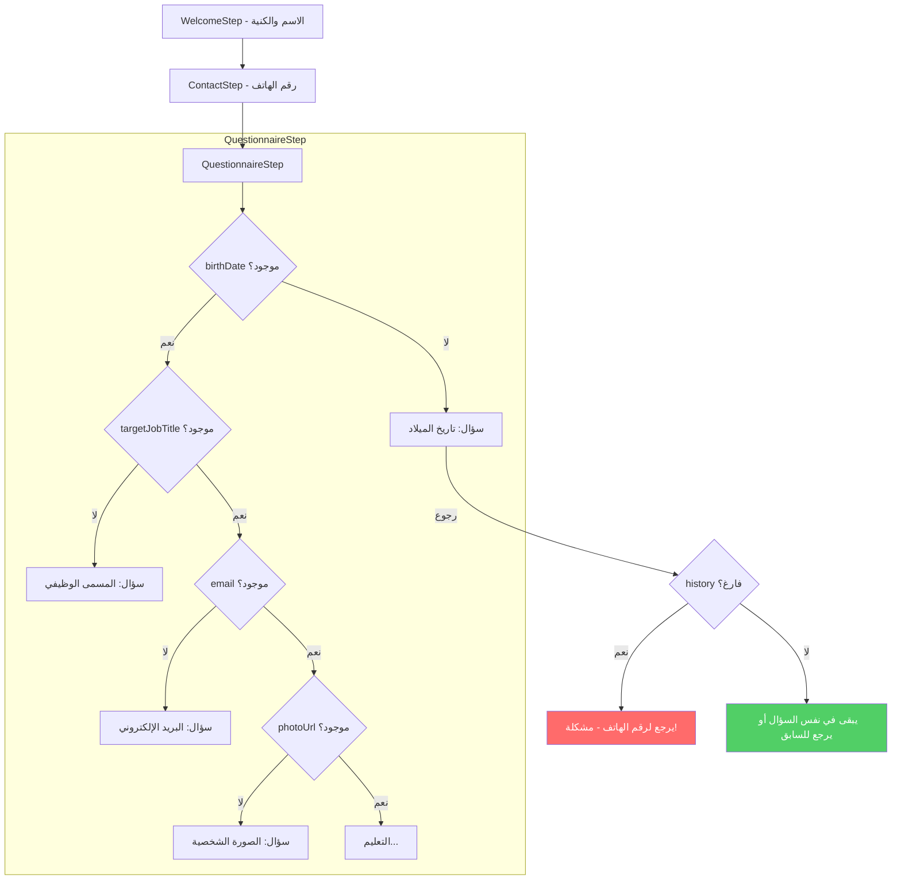

# خطة إصلاح زر الرجوع في التنقل الداخلي

## 📋 ملخص المشكلة

عند استخدام "البدء البسيط"، بعد إدخال الاسم والكنية والانتقال لرقم الهاتف ثم تاريخ الميلاد، إذا ضغط المستخدم "رجوع" يرجع لرقم الهاتف بدلاً من البقاء في نفس السؤال أو العودة للسؤال السابق المنطقي.

### نفس المشكلة تظهر في:
- تاريخ الميلاد (birthDate)
- المسمى الوظيفي (targetJobTitle)
- البريد الإلكتروني (email)
- اختيار الصورة الشخصية (photoUrl)
- ضمن التعليم: زر الرجوع يذهب دائماً لرقم الهاتف

---

## 🔍 السبب الجذري

### في الملف [`src/components/wizard/QuestionnaireStep.tsx`](src/components/wizard/QuestionnaireStep.tsx):

```typescript
// السطر 302-307
const handleInternalBack = () => {
    // If history is empty, go back to previous step (Contact)
    if (questionHistory.length === 0) {
        onBack();  // ⚠️ هذا يرجع لرقم الهاتف!
        return;
    }
    // ...
};
```

### المشكلة:
1. **الـ `questionHistory` يبدأ فارغاً** عند الدخول لـ QuestionnaireStep
2. **يتم إضافة السؤال للـ history فقط بعد الإجابة عليه** (في `handleAnswer`)
3. **عند الضغط على "رجوع" من سؤال لم تتم الإجابة عليه بعد**:
   - الـ history فارغ
   - يتم استدعاء `onBack()` الذي يرجع للخطوة السابقة (ContactStep - رقم الهاتف)

### مثال توضيحي:
1. المستخدم يدخل الاسم والكنية ← ينتقل لرقم الهاتف
2. يدخل رقم الهاتف ← ينتقل لتاريخ الميلاد (السؤال الأول في QuestionnaireStep)
3. يضغط "رجوع" بدون إجابة ← **history فارغ** ← يرجع لرقم الهاتف! ❌

---

## ✅ الحل المقترح

### الحل: تهيئة `questionHistory` عند تحميل المكون

عند تحميل `QuestionnaireStep`، يجب فحص البيانات الموجودة وتعبئة الـ history بالأسئلة التي تمت الإجابة عليها سابقاً.

### التعديلات المطلوبة:

#### 1. إضافة دالة لتهيئة الـ history في [`QuestionnaireStep.tsx`](src/components/wizard/QuestionnaireStep.tsx):

```typescript
// دالة لتهيئة الـ history بناءً على البيانات الموجودة
const initializeHistoryFromData = (data: CVData): HistoryEntry[] => {
    const history: HistoryEntry[] = [];
    
    // المعلومات الشخصية
    if (data.personal.birthDate && data.personal.birthDate !== '__skipped__') {
        history.push({ field: 'birthDate' });
    }
    if (data.personal.targetJobTitle) {
        history.push({ field: 'targetJobTitle' });
    }
    if (data.personal.email && data.personal.email !== '__skipped__') {
        history.push({ field: 'email' });
    }
    if (data.personal.photoUrl && data.personal.photoUrl !== '__skipped__') {
        history.push({ field: 'photoUrl' });
    }
    
    // التعليم
    if (data.education && data.education.length > 0) {
        history.push({ field: 'education_has' });
        data.education.forEach((edu, index) => {
            if (edu.institution) history.push({ field: 'education_institution', entryIndex: index });
            if (edu.degree) history.push({ field: 'education_degree', entryIndex: index });
            if (edu.major) history.push({ field: 'education_major', entryIndex: index });
            if (edu.startYear) history.push({ field: 'education_startYear', entryIndex: index });
            if (edu.endYear) history.push({ field: 'education_endYear', entryIndex: index });
        });
    }
    
    // ... نفس المنطق للخبرات واللغات والهوايات
    
    return history;
};
```

#### 2. استدعاء دالة التهيئة عند تحميل المكون:

```typescript
// إضافة useEffect لتهيئة الـ history
useEffect(() => {
    const initialHistory = initializeHistoryFromData(data);
    if (initialHistory.length > 0 && questionHistory.length === 0) {
        setQuestionHistory(initialHistory);
    }
}, []); // يتم التنفيذ مرة واحدة عند تحميل المكون
```

---

## 📊 مخطط تدفق التنقل



---

## 📁 الملفات المطلوب تعديلها

| الملف | التعديل |
|-------|---------|
| [`src/components/wizard/QuestionnaireStep.tsx`](src/components/wizard/QuestionnaireStep.tsx) | إضافة دالة `initializeHistoryFromData` واستدعائها عند التحميل |

---

## 🧪 كيفية الاختبار

1. افتح التطبيق واختر "البدء البسيط"
2. أدخل الاسم والكنية ← التالي
3. أدخل رقم الهاتف ← التالي
4. **اختبر زر الرجوع** من تاريخ الميلاد ← يجب أن يبقى في نفس الصفحة أو يرجع للسؤال السابق المنطقي
5. أدخل تاريخ الميلاد ← التالي
6. **اختبر زر الرجوع** من المسمى الوظيفي ← يجب أن يرجع لتاريخ الميلاد
7. أكمل حتى التعليم واختبر زر الرجوع من أسئلة التعليم

---

## ⚠️ ملاحظات إضافية

- يجب مراعاة أن بعض الحقول يمكن تخطيها (skippable) مثل `birthDate` و `email` و `photoUrl`
- يجب التحقق من القيمة `__skipped__` عند تهيئة الـ history
- يجب اختبار السيناريو عندما يعود المستخدم لاحقاً (من localStorage)
